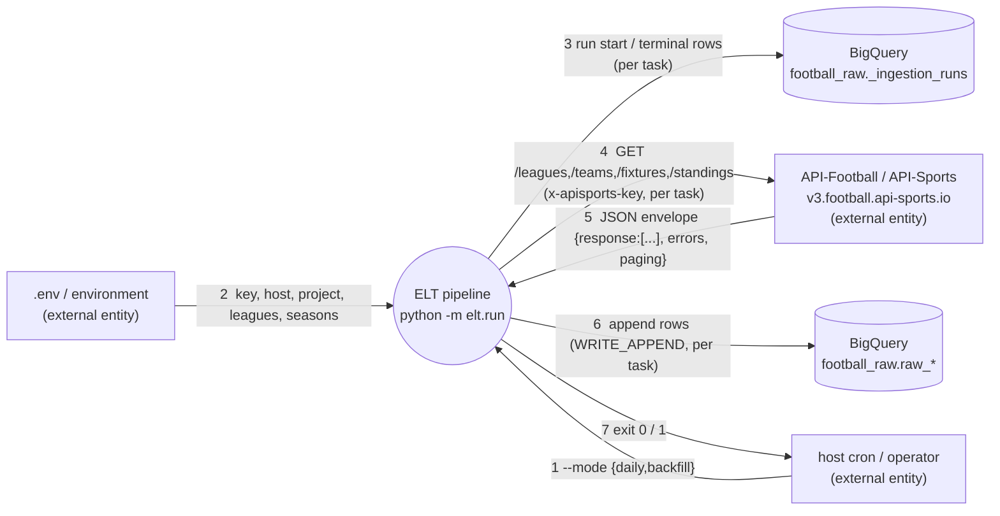
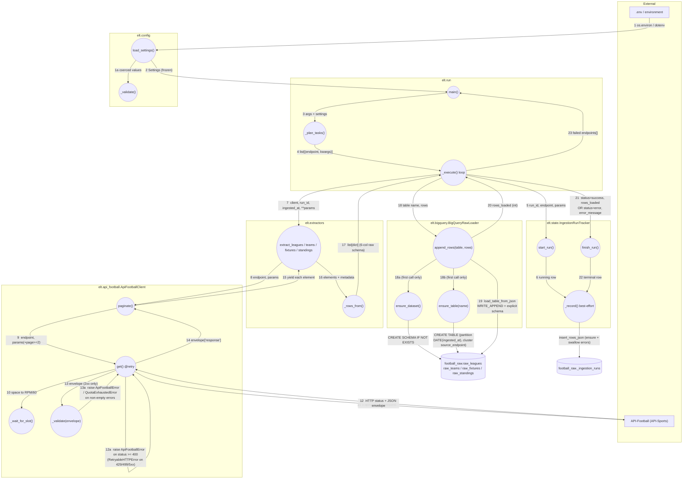
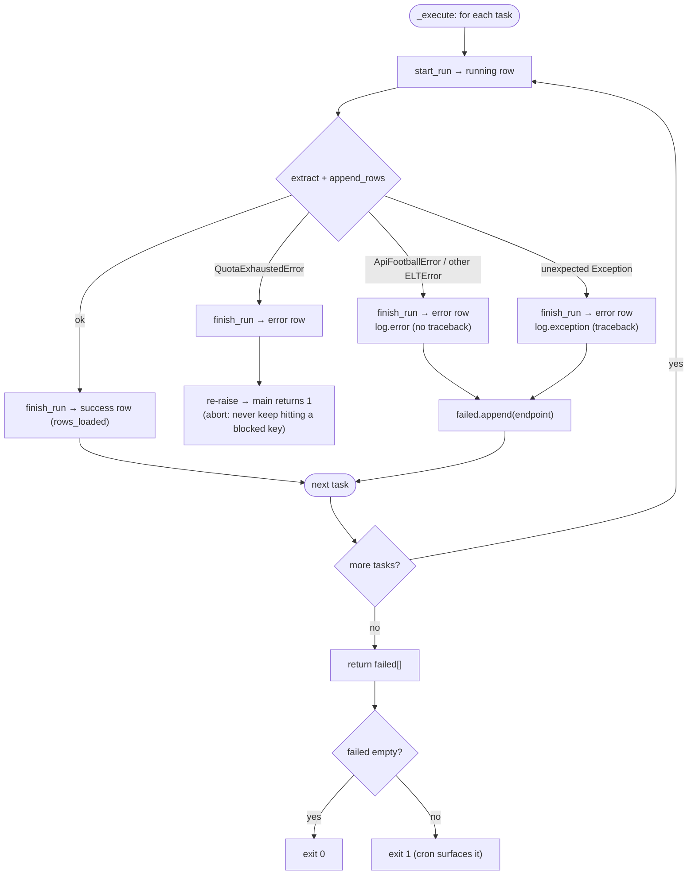
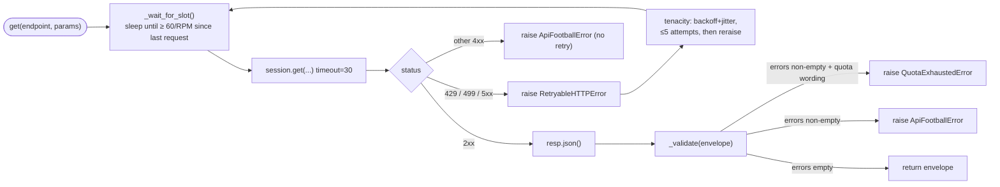

# Data Flow — Extraction → BigQuery Load (Phase 2)

How a `python -m elt.run` invocation moves data from API-Football into the raw
BigQuery tables. Covers `elt/` only; the dbt transform layer is out of scope
here (see `PLAN.md` §Phase 3).

This document contains two kinds of diagram, deliberately kept separate:

- **Data-flow diagrams (DFDs)** — sections 1–2. *What data moves where.*
  Processes, data stores, external entities, labelled data flows. Flow labels
  carry a **step number** as a reading aid, but the diagrams still express no
  decisions or branching — for those, see the flowcharts.
- **Flowcharts** — sections 4–5. *In what order, with what branches.* Decision
  points, loops, sequencing — things a DFD cannot express but that matter here
  (failure propagation, the retry loop).

Section 3 is a data dictionary, not a diagram.

Notation (DFDs): rounded boxes = **processes** (functions/classes), square
boxes = **external entities**, cylinders = **data stores**, labelled arrows =
**data flows**.

---

## 1. DFD — Level 0 (context diagram)

Steps 3–6 repeat once per planned task (endpoint × league × season).

---

## 2. DFD — Level 1 (pipeline internals)

Processes and the data flowing between them. Arrow labels are prefixed with a
**step number** giving the execution sequence; the data description follows.
Steps 6–17 run once per planned task (the `_execute` loop); steps 1–5 run once
per invocation.

| step | when | operation |
|---|---|---|
| 1–2 | once | load `.env` → validate → frozen `Settings` |
| 3–4 | once | `main()` → `_plan_tasks()` expands mode into the task list |
| 5–6 | per task | write the `running` row to `_ingestion_runs` |
| 7 | per task | `_execute` invokes the endpoint's extractor |
| 8–15 | per task | `paginate` → `get` (rate-limit wait, request, envelope `_validate`) → elements |
| 16–17 | per task | `_rows_from` wraps each element into the 6-column raw row |
| 18–20 | per task | `append_rows` (first call also ensures dataset + table), `WRITE_APPEND` load |
| 21–22 | per task | write the terminal (`success`/`error`) row |
| 23 | once | `_execute` returns failed endpoints → exit 0 / 1 |

---

## 3. Data dictionary — the row that gets written

Every `response[]` element becomes one row, identical schema across all four
`raw_*` tables:

| column | source | example |
|---|---|---|
| `run_id` | `uuid4().hex`, once per invocation | `a2a1813c94de47f7…` |
| `ingested_at` | `datetime.now(timezone.utc).isoformat()`, once per invocation | `2026-09-09T13:54:20…Z` |
| `source_endpoint` | the endpoint name | `fixtures` |
| `request_params` | `json.dumps(params, sort_keys=True)` | `{"league": 39, "season": 2025}` |
| `payload` | `json.dumps(element, sort_keys=True, separators=(",",":"))` | `{"fixture":{…},"teams":{…},"goals":{…}}` |
| `record_hash` | `sha256(payload)` | `e3b0c44298fc1c14…` |

Partitioned on `DATE(ingested_at)`, clustered on `source_endpoint`.

---

## 4. Flowchart — control flow / failure handling

Not a DFD: this has decisions and loops. It shows the order the `_execute` loop
runs things and how each failure class is handled.

Key invariants:

- **`run_id` + `ingested_at` are stamped once** in `main()` and shared by every
  row of every task in that invocation — this is what links `raw_*` rows to
  their `_ingestion_runs` entry.
- **Append-only.** `append_rows` never updates or deletes. Re-running the same
  day appends duplicate payloads; `record_hash` makes them cheap to detect and
  dbt's `ROW_NUMBER() … ORDER BY ingested_at DESC` collapses them downstream.
- **Tracking is best-effort.** A failure inside `IngestionRunTracker` is logged
  and swallowed — telemetry never crashes the pipeline it observes.
- **The envelope hides the HTTP status.** API-Football returns `200` on most
  failures (wrong-but-well-formed key, quota exhaustion, missing/unknown
  params), so `_validate(envelope)` in the client is the real success/failure
  gate, not `resp.status_code`. The exception is a missing or malformed key
  header, rejected at the edge with a real `403` — which `get()` still catches
  via its `status >= 400` branch, so both cases surface as `ApiFootballError`.

---

## 5. Flowchart — rate limiting & retries (inside `get()`)

Not a DFD: the retry loop and status branching are control flow.

